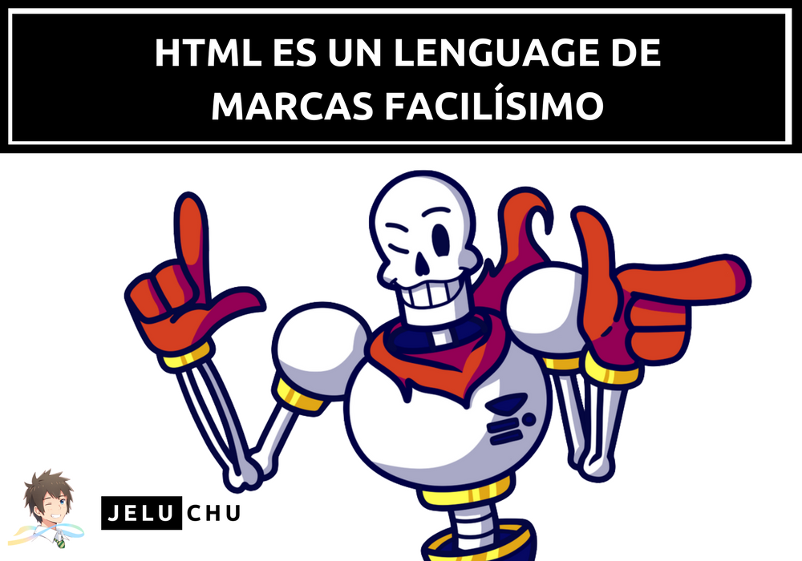

## Introducción
Comenzamos un nuevo tema, y en esta ocasion comenzamos aprendiendo uno de los llamados **"Lenguajes de Marcas"** , para ser más concretos aún, lo que podréis encontrar aquí, principalmente será **"HTML"**, aunque a medida que se avance, es posible que también aparezca información sobre **"CSS"**.

##

### CRONOLOGÍA
- **1993:** HTML (HyperText Markup Language), se trata de la primera versión de HTML no estandarizada, que permitía el uso de párrafos, cabeceras, saltos de línea, listas, etc. Se fueron añadiendo: negrita, formularios…
- **1995:** HTML 2.0 publicado como estándar. Define elementos de formulario: INPUT, SELECT. También tiene enlaces, cabeceras, etc
- **1997:** HTML 3.2 publicada por W3C (WWWC – World Wide Web Consortium). Incluye scripts y hojas de estilo (CSS)
- **1998:** HTML 4.0 publicado por la W3C. Incluye etiquetas nuevas para CSS: div, span.
- **1999:** HTML 4.1 publicado por la W3C
- **2000**: Se creó una versión estricta del HTML basándose en la versión 4.1, además de salir la versión 1.0 de XHTML
- **2010:** HTML 5
##
### ENTORNOS WEB
Se basan en la explotación de los recursos existentes en el WWW (World Wide Web).  Esta red es un conjunto de recursos de información, estructurada en forma de hipertexto y que se encuentra operativa mediante la red internet. En ellas se emplean:
> **Lenguaje de marcas** que permite manejar la información en forma de hipertexto

> Protocolo **HTTP/HTTPS**

>**Uniform Resource Locator** (URL): Especifica cómo a cada página de información se le asocia un "nombre" único.

La estructura simple que se usa es la siguiente:
- **Texto simple**
- **Imágenes**
- **Enlaces a otros elementos**
	- **Locales:** Enlaces a lugares del mismo documento
	- **Externos:** Enlaces a otros documentos del mismo servidor o de otro distinto

  
  
