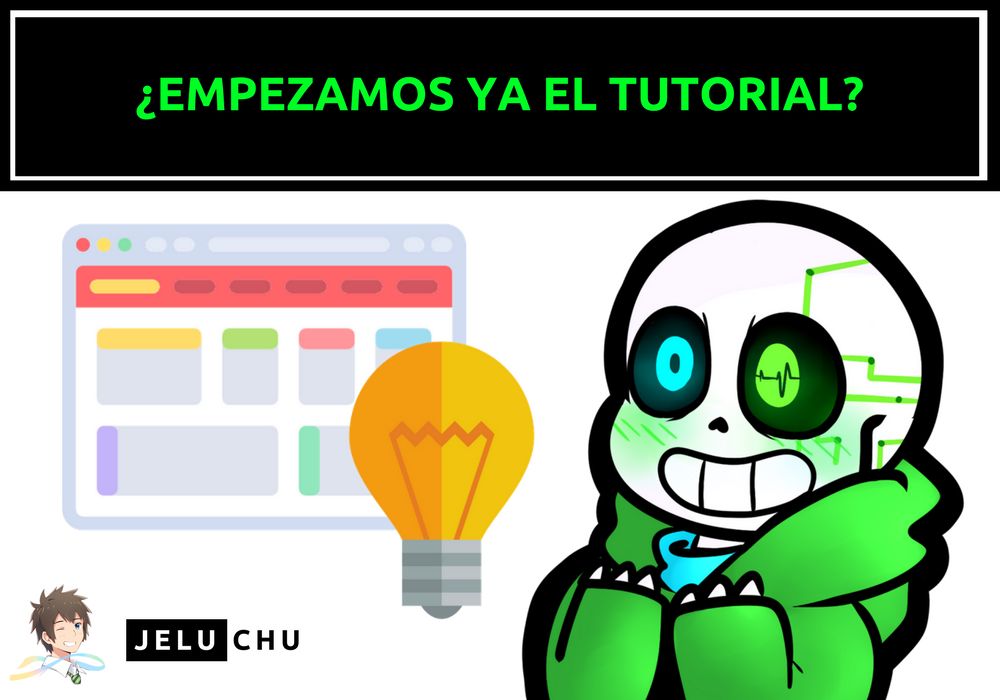

## Introducción
Antes de lanzarnos a programar en este lenguaje, aquí podrás encontrar algunas de las características destacables de este lenguaje de marcas.

##

### CARACTERÍSTICAS HTML
- **Estandarizado y multiplataforma**
- Es un **estándar** internacional mantenido por **W3C**
- **No es un lenguaje de programación** como tal. Para añadir ese tipo de características deberíamos añadir scripts como por ejemplo de javascript
- Un documento en HTML, **debe de ser leído e interpretado por cualquier navegador** (Safari, Ópera, Firefox, Chrome...)
- Es un **lenguaje de marcas muy sencillo** que te permite escribir en hipertexto.
- La descripción se basa en **especificar** en el texto la **estructura lógica** del contenido
- Los documentos HTML son **ficheros de texto (ASCII)** que se pueden crear con cualquier editor de texto. El formato más conocido es **.html**
- Es bueno ir **depurando el código** e ir visualizando como quedaría nuestra web, para ello existen programas como Adobre Dreamweaver
- Es un **texto plano** que es **interpretado por un navegador**

  ##

   
