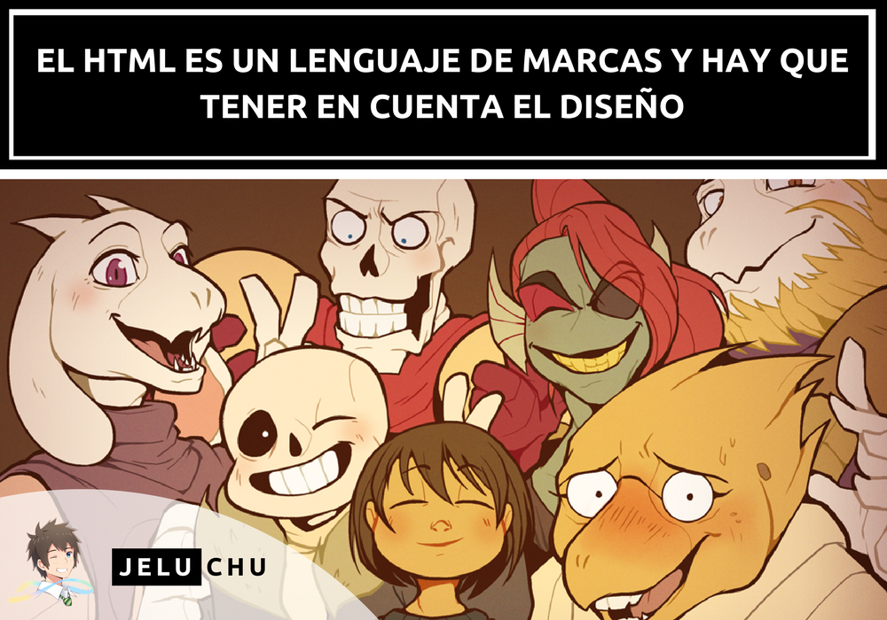

## Introducción
Ya sabemos más o menos las etiquetas que nos podemos encontrar en la parte del **< HEAD >**, así que porqué no continuámos y vemos las que podemos encontrar en el **< BODY >**. Como siempre, podrás disponer de diversos ejemplos sencillos de lo visto en esta lección.

##

### ETIQUETAS EN EL BODY
#### < ATRIBUTOS >
Todos los atributos de body se recomiendan mediante CSS. Los tributos más utilizados son:
- **BGCOLOR:** Color de fondo del cuerpo
```
	<body bgcolor="Color">
```
[Colores en W3 SCHOOLS](https://www.w3schools.com/colors/colors_names.asp)
>Color se puede especificar de los siguientes modos
- **NombreColor:** Especifica el nombre del color según una constante predefinida en HTML
- **#ValorHexadecimal:** Especificar el valor hexadecimal para las componentes RGB del color

|RGB|  HEXADECIMAL | COLOR |
|--|--|--|
| (255, 0, 0) |#FF0000  |ROJO
| (120, 40, 25) | #782819 |MARRÓN

 - **BACKGROUND:** Especifica una imagen fija para el fondo
 ```
   <body background="FicheroImagen">
 ```
Color de texto y de los enlaces:
- **TEXT:** Color del texto del documento
- **LINK:** Color de los enlaces no visitados
- **VLINK:** Color de los enlaces ya visitados
- **ALINK:** Color de los enlaces activos

Todos los colores se pueden especificar de la siguiente manera:
```
   <nombre> ó <#valorHexadecimal>
```
 ##
 #### < PÁRRAFOS >
```
<p>
	Bloque del párrafo
</p>
```
Crea un párrafo dejando una línea antes y después. Contiene un atributo para especificar el alineado del texto **align = left, center, right** (estos valores están en deshuso).
```
<div>
	Bloque del párrafo
</div>
```
Crea un párrafo, con una división del documento en un elemento que se puede referenciar. También tiene atributo align (como p)
```
<span>
	Bloque del párrafo
</span>
```
Crea un elemento en línea para que pueda usarse como un elemento individual.
 ##
  
  
