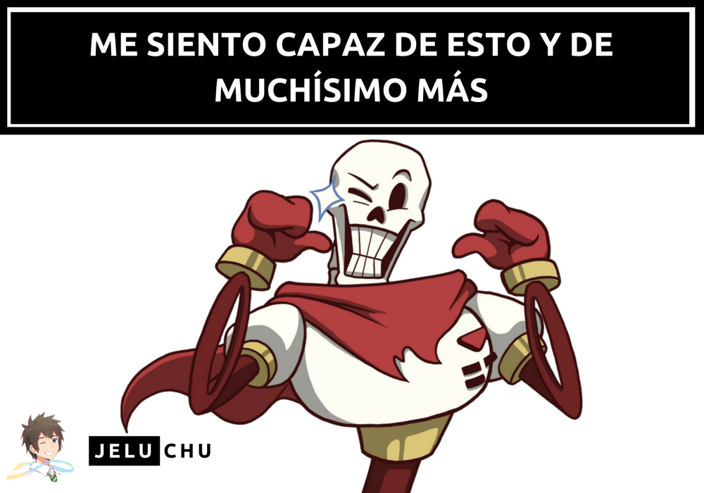

## Introducción
En este apartado ya encontrarás ejemplos de la estructura de los documentos más básicos de HTML, pero para ello, te aconsejamos antes de nada que leas esta lección en la que aprenderás más detenidamente cada parte del esqueleto de este lenguaje de marcas.

##

### ESTRUCTURA DE UN DOCUMENTO HTML
```
	<html>
	  <head>
	  </head>
	  <body>
	  </body>
	</html>
```

- **HTML:** Indica un tipo de documento HTML.
	- **HEAD**: Contiene la información del documento
	- **HTML**: que no se representa en la ventana del navegador
	- **BODY**: Contiene la información del documento por el navegador

La **etiqueta HTML indica la versión del documento** que se está utilizando. Esta versión determina la sintaxis y la estructura de todos los elementos que se usan en el documento HTML. Este documento se llama **DTD** (Data Type Definition).

Para indicar el tipo de documento:
```
<!DOCTYPE HTML PUBLIC [fpi][url_dtd]>
```
Dónde:
 - **FPI:** Indica el identificador público de formato. (Format Public Identifier)
 - **URL_DTD:** Ubicación del fichero que contiene la DTD que indica el formato

  ##

  
